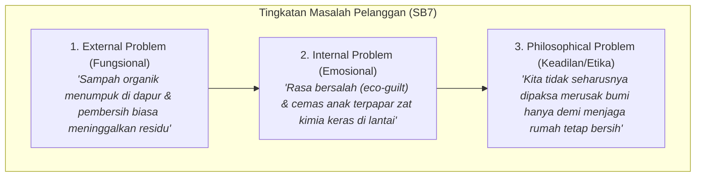
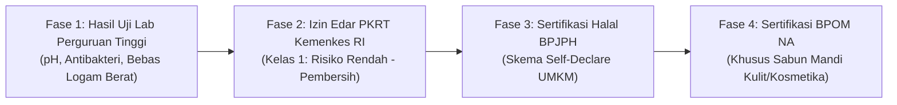

# WHITEPAPER AKADEMIK: PENERAPAN FRAMEWORK STORYBRAND 7 (SB7) PADA DIGITALISASI PRODUK ECO-ENZYME KOMUNITAS DESA JERUKLEGI

**Dokumen Laporan Akademik & Landasan Desain Konseptual**  
*Program Pengabdian Kepada Masyarakat & Hilirisasi Inovasi Lingkungan*  
Tahun: 2026

---

## 1. Abstrak & Latar Belakang Masalah

Inovasi pengolahan limbah organik rumah tangga berbasis *Eco-Enzyme* di Desa Jeruklegi, Jawa Tengah, merupakan wujud nyata gerakan ekonomi sirkular (*circular economy*) berbasis komunitas. Melalui fermentasi limbah kulit buah dan sayuran dapur selama minimal 3 bulan, masyarakat berhasil memproduksi cairan pembersih serbaguna alami yang bebas bahan kimia berbahaya.

Namun, tantangan terbesar pada tahap hilirisasi program pengabdian masyarakat bukanlah pada proses produksi, melainkan pada **komunikasi nilai (*value proposition*) dan penerimaan publik (*market adoption*)**. 

Sebagian besar proyek sejenis gagal menjangkau adopsi luas karena menggunakan paradigma pemasaran klasik (AIDA) yang berpusat pada diri sendiri (*brand-centric*): menceritakan kehebatan formula kimia, proses fermentasi yang rumit, atau sekadar menampilkan katalog produk statis. Pendekatan ini terbukti menimbulkan beban kognitif (*cognitive overload*) bagi masyarakat umum dan ibu rumah tangga.

Dokumen ini memaparkan transformasi arsitektur digital landing page Eco-Enzyme Jeruklegi menggunakan pendekatan **StoryBrand 7-Part Framework (SB7)** karya Donald Miller, yang dipadukan dengan kepatuhan etika data, standar regulasi nasional, dan transparansi ekonomi komunitas.

---

## 2. Landasan Teori: Mengapa StoryBrand 7 (SB7)?

Model komunikasi SB7 berpijak pada prinsip dasar neurobiologi dan psikologi kognitif manusia: **otak manusia secara alami menyukai cerita (narasi) dan selalu berusaha menghemat energi kognitif**.

| Parameter Perbandingan | Model Klasik (AIDA / Konvensional) | Model StoryBrand 7 (SB7) |
| :--- | :--- | :--- |
| **Pusat Cerita (*The Protagonist*)** | Produk / Komunitas Jeruklegi ("Lihat produk hebat kami") | Calon Pembeli / Ibu Rumah Tangga ("Kamu ingin rumah bersih dan aman") |
| **Posisi Brand** | Pahlawan (*The Hero*) | Pemandu (*The Guide*) yang berempati dan terpercaya |
| **Definisi Masalah** | Hanya masalah fungsional (lantai kotor) | 3 Lapis Masalah: Fungsional, Emosional, dan Filosofis |
| **Penanganan Friksi Pembelian** | Mengasumsikan pembeli langsung mengerti cara transaksi | Menyediakan *Plan* (3 langkah jelas) untuk meredam kecemasan |
| **Pemicu Aksi (*Call to Action*)** | Satu tombol beli kaku | Ajakan Ganda: *Direct CTA* (siap beli) & *Transitional CTA* (ingin tahu dulu) |

### Transformasi Peran: Hero vs. Guide
Dalam SB7, **komunitas Jeruklegi tidak memposisikan dirinya sebagai pahlawan**. Pahlawannya adalah seorang ibu atau kepala keluarga yang setiap hari bergulat dengan sampah dapur dan khawatir terhadap residu bahan kimia sintetis di lantai rumah tempat anak-anaknya bermain.

Komunitas Jeruklegi hadir sebagai **The Guide (Pemandu)** yang memiliki dua sayap mutlak:
1. **Empati (*Empathy*)**: *"Kami mengerti perasaan bersalah saat membuang sisa makanan, dan kekhawatiranmu terhadap produk kimia keras."*
2. **Otoritas (*Authority*)**: *"Produk kami didampingi oleh riset akademis perguruan tinggi dan diuji dengan standar mutu higienis."*

---

## 3. Dekonstruksi 3 Lapis Masalah Pelanggan

Agar pesan komunikasi mengena secara mendalam, SB7 menuntut artikulasi masalah dalam 3 tingkatan yang telah diwujudkan dalam komponen `Problem.jsx`:



Kartu tengah (*Internal Problem*) diberikan penekanan kontras paling kuat (latar belakang hijau hutan dengan teks putih) karena **pelanggan membeli solusi untuk menyelesaikan masalah internal mereka**, bukan sekadar masalah eksternal.

---

## 4. Rekayasa Alur Psikologi Halaman (10 Seksi)

Halaman landing page dirancang secara linear mengikuti perjalanan emosi manusia:

1. **Hero Section (`Hero.jsx`)**: 
   - *Tujuan Emosi*: Harapan & Keingintahuan.
   - *Copy*: *"Sisa Dapur Kamu Bisa Jadi Lebih dari Sekadar Sampah."*
   - Dilengkapi *Dual CTA*: Tombol utama (Direct CTA ke WhatsApp) dan tombol eksplorasi (Transitional CTA ke Masalah).
2. **Problem Section (`Problem.jsx`)**:
   - *Tujuan Emosi*: Resonansi & Validasi Emosional (*"Ini benar-benar tentang aku"*).
3. **The Guide Section (`About.jsx`)**:
   - *Tujuan Emosi*: Rasa Percaya & Kelegaan.
   - Menggabungkan empati warga Jeruklegi dengan **Lencana Otoritas Akademis** (pendampingan pengabdian perguruan tinggi).
4. **Products Catalog (`Products.jsx`)**:
   - *Tujuan Emosi*: Kepastian Solusi Konkret.
   - Diletakkan **sebelum** seksi Cara Pesan agar pengunjung memahami wujud dan manfaat solusi sebelum diajak bertransaksi. Dilengkapi label *Harga Komunitas* yang transparan.
5. **The Plan (`Plan.jsx`)**:
   - *Tujuan Emosi*: Eliminasi Hambatan Mental (*Zero Purchase Friction*).
   - Menunjukkan 3 langkah mudah: 1. Pilih Produk, 2. Chat WhatsApp, 3. Terima Produk di Rumah.
6. **The Stakes (`Stakes.jsx`)**:
   - *Tujuan Emosi*: *Constructive Loss Aversion* (Urgensi Positif).
   - Menggunakan latar belakang gelap kontras (`bg-brand-primary`) untuk mengingatkan bahwa tanpa aksi, residu kimia dan penumpukan sampah TPA akan terus berlanjut.
7. **Success Vision (`SuccessVision.jsx`)**:
   - *Tujuan Emosi*: Optimisme & Gambaran Transformasi Nyata.
   - Visualisasi rumah yang bersih alami, anak-anak aman bermain di lantai, dan kebanggaan menjadi bagian dari solusi lingkungan.
8. **Social Proof (`Testimonials.jsx`)**:
   - *Tujuan Emosi*: Validasi Sosial (*"Orang lain yang seperti saya sudah membuktikannya"*).
   - Metrik dampak terukur (350+ kg limbah diolah, 85+ keluarga teredukasi, 24 warga berdaya).
9. **Final CTA (`FinalCTA.jsx`)**:
   - *Tujuan Emosi*: Keberanian Mengambil Tindakan Akhir.
10. **Footer (`Footer.jsx`)**:
    - *Tujuan Emosi*: Keterbukaan & Integritas Kontak Komunitas.

---

## 5. Etika Data & Transparansi Sosial

### Filosofi "Harga Komunitas" (*Community Pricing*)
Penetapan harga (Rp 15.000 – Rp 25.000) tidak dilabeli dengan kata "Harga Retail" atau "Price", melainkan **"Harga Komunitas"**.
* **Landasan Teori**: Ekonomi moral (*moral economy*) dan sosiologi ekonomi perdesaan.
* **Makna Komunikatif**: Biaya yang dibayarkan pelanggan merupakan kontribusi gotong-royong pengganti bahan baku wadah, gula tebu/molase, dan operasional ibu-ibu perajin, bukan laba komersial korporat pemodal besar. Pendekatan ini menepis anggapan bahwa produk ramah lingkungan adalah produk mahal/elitis.

### Integritas Data & Kontrol Isolasi (*Feature Flag*)
Dalam dunia akademik, kejujuran data adalah harga mati:
* Komponen `Testimonials.jsx` dilengkapi *safety barrier*:
  ```javascript
  if (!SHOW_TESTIMONIALS || TESTIMONIALS.length === 0) return null;
  ```
* Data simulasi prototipe yang digunakan saat ini ditandai secara eksplisit di [src/constants/data.js](file:///c:/Users/sofya/Documents/JS/eco-enzyme-landing/src/constants/data.js) dengan SOP verifikasi data riil lapangan sebelum diluncurkan ke ranah komersial publik.

---

## 6. Roadmap Kepatuhan Standar Regulasi Nasional

Untuk memperkuat kredibilitas ilmiah proyek di mata penguji akademik dan regulator pemerintah, produk Eco-Enzyme memiliki peta kepatuhan legalitas formal di Indonesia:



1. **Uji Mutu Laboratorium Perguruan Tinggi (Target Segera)**:
   - *Uji Daya Hambat Antibakteri*: Terhadap bakteri patogen rumah tangga umum (*Escherichia coli* dan *Staphylococcus aureus*).
   - *Uji Derajat Keasaman (pH)*: Memastikan formula stabil dan aman pada rentang pH standar pembersih rumah tangga (pH 3.0 - 4.5 untuk cairan murni asam organik terfermentasi, dan dinetralkan untuk sabun batang).
   - *Uji Logam Berat*: Memastikan limbah buah bebas dari timbal (Pb), arsenik (As), dan merkuri (Hg).
2. **Izin Edar PKRT (Perbekalan Kesehatan Rumah Tangga) Kemenkes RI**:
   - Berdasarkan Permenkes tentang PKRT, cairan pembersih lantai, pembersih kaca, dan pembersih toilet masuk dalam **Kelas 1 (Risiko Rendah)**.
   - Pendaftaran dilakukan melalui sistem elektronik e-Farmalkes Kemenkes dengan melampirkan formula komposisi, label kemasan, dan hasil uji laboratorium.
3. **Sertifikasi Halal (BPJPH Kemenag)**:
   - Produk pembersih berbahan 100% nabati (kulit buah, air, molase) memenuhi kriteria *Halal Positive List* sehingga sangat layak diajukan melalui mekanisme *Self-Declare* pendampingan UMKM desa.

---

## 7. Kesimpulan

Penerapan framework StoryBrand 7 (SB7) pada landing page Eco-Enzyme Jeruklegi berhasil mentransformasi proyek pengabdian masyarakat dari etalase statis menjadi narasi perubahan sosial yang menggugah. 

Dengan memposisikan masyarakat sebagai pahlawan, menyederhanakan cara pesan lewat WhatsApp, menjamin integritas data, serta menyiapkan roadmap standar uji nasional (Kemenkes & Lab Universitas), proyek ini memenuhi kriteria keunggulan akademis sekaligus daya guna terapan di masyarakat.
